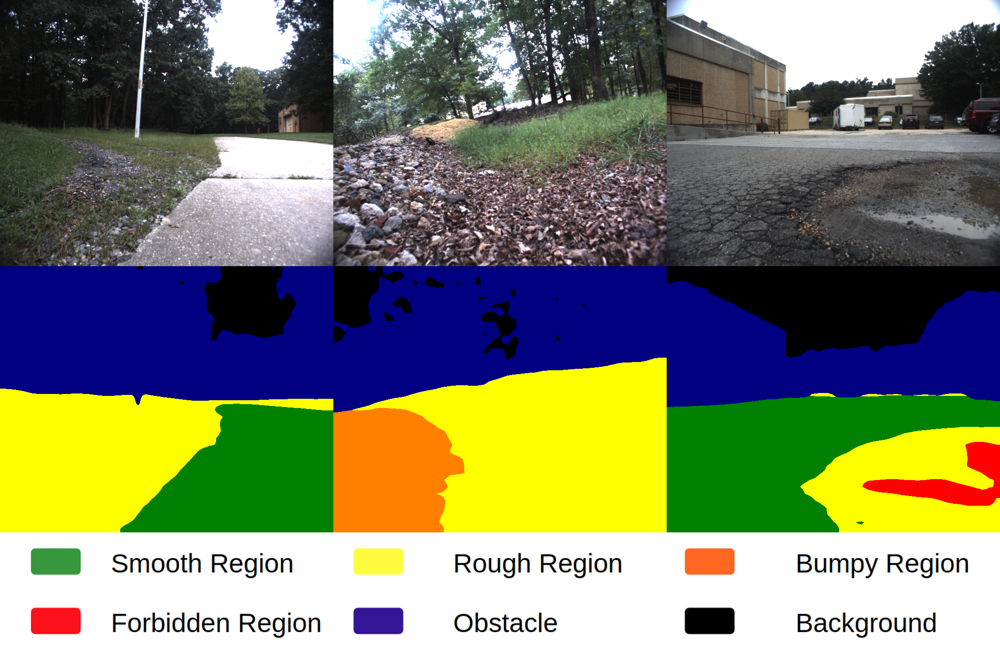

# GANav: Efficient Terrain Segmentation for Robot Navigation in Unstructured Outdoor Environments (Accepted by RAL/IROS 2022)

[](https://github.com/rayguan97/GANav-offroad/stargazers)
[](https://github.com/rayguan97/GANav-offroad/network)
[](https://github.com/rayguan97/GANav-offroad/issues)
[](https://github.com/rayguan97/GANav-offroad/blob/master/LICENSE)


This is the code base for:

[GANav: Efficient Terrain Segmentation for Robot Navigation in Unstructured Outdoor Environments](https://gamma.umd.edu/offroad).
<br> Tianrui Guan, Divya Kothandaraman, Rohan Chandra, Adarsh Jagan Sathyamoorthy, Kasun Weerakoon, Dinesh Manocha


## Updates:
07-25-2022: The latest version of GA-Nav is ready. Please make sure to pull the latest changes. Please refer to `./trained_models` folder and new model is available [here](https://drive.google.com/drive/folders/1PYn_kT0zBGOIRSaO_5Jivaq3itrShiPT?usp=sharing).

06-17-2022: Accepted by RAL/IROS.

02-21-2022: Updated code and checkpoints in preparation.

12-09-2021: Updated ros-support for GANav [here](https://github.com/rayguan97/GANav-offroad/tree/main/ros_support).

05-10-2021: Trained models are ready. ~~Please refer to `./trained_models` folder. Please download the trained model [here](https://drive.google.com/drive/folders/1PYn_kT0zBGOIRSaO_5Jivaq3itrShiPT?usp=sharing).~~

If you find this project useful in your research, please cite our work:

```latex
@ARTICLE{9810192,
  author={Guan, Tianrui and Kothandaraman, Divya and Chandra, Rohan and Sathyamoorthy, Adarsh Jagan and Weerakoon, Kasun and Manocha, Dinesh},
  journal={IEEE Robotics and Automation Letters}, 
  title={GA-Nav: Efficient Terrain Segmentation for Robot Navigation in Unstructured Outdoor Environments}, 
  year={2022},
  volume={7},
  number={3},
  pages={8138-8145},
  doi={10.1109/LRA.2022.3187278}}
```

Our video can be found [here](https://www.youtube.com/watch?v=QN5FKakQwfo).

# Introduction




We propose GANav, a novel group-wise attention mechanism to identify safe and navigable regions in off-road terrains and unstructured environments from RGB images. Our approach classifies terrains based on their navigability levels using coarse-grained semantic segmentation. Our novel group-wise attention loss enables any backbone network to explicitly focus on the different groups' features with low spatial resolution. Our design leads to efficient inference while maintaining a high level of accuracy compared to existing SOTA methods. 

Our extensive evaluations on the RUGD and RELLIS-3D datasets shows that GANav achieves an improvement over the SOTA mIoU by 2.25-39.05% on RUGD and 5.17-19.06% on RELLIS-3D. We interface GANav with a deep reinforcement learning-based navigation algorithm and highlight its benefits in terms of navigation in real-world unstructured terrains. We integrate our GANav-based navigation algorithm with ClearPath Jackal and Husky robots, and observe an increase of 10% in terms of success rate, 2-47% in terms of selecting the surface with the best navigability and a decrease of 4.6-13.9% in trajectory roughness. Further, GANav reduces the false positive rate of forbidden regions by 37.79%. Code, videos, and a full technical report are available at https://gamma.umd.edu/offroad/.

# Environment


### Step 1: Create Conda Environment

```
conda create -n ganav python=3.7 -y
conda activate ganav
conda install pytorch=1.6.0 torchvision cudatoolkit=10.1 -c pytorch
# or use 
# conda install pytorch=1.10.0 torchvision cudatoolkit=11.3 -c pytorch
```

### Step 2: Installing MMCV (1.3.16)

```
pip install mmcv-full -f https://download.openmmlab.com/mmcv/dist/cu101/torch1.6.0/index.html
# or use
# pip install mmcv-full -f https://download.openmmlab.com/mmcv/dist/cu113/torch1.10.0/index.html
```
Note: Make sure you mmcv version is compatible with your pytorch and cuda version. In addition, you can specify the MMCV verion (1.3.16).

### Step 3: Installing GANav
```
git clone https://github.com/rayguan97/GANav-offroad.git
cd GANav-offroad
pip install einops prettytable
pip install -e . 
```


# Get Started

In this section, we explain the data generation process and how to train and test our network.

## Data Processing

To be able to run our network, please follow those steps for generating processed data.

### Dataset Download: 

Please go to [RUGD](http://rugd.vision/) and [RELLIS-3D](https://github.com/unmannedlab/RELLIS-3D/blob/main/README.md#annotated-data) (we use the ID annotation instead of color annotation for RELLIS-3D) officail website to download their data. Download the [GOOSE](https://goose-dataset.de/docs/setup/#download-dataset) dataset, and extract all zips in `data/goose` to match the below structure.
<!-- Please structure the downloaded data as follows: -->

Note: Since RELLIS-3D dataset has been updated, please run `python ./tools/process_rellis.py` to remove "pylon_camera_node/", "pylon_camera_node_label_id/" folder, after structure the data as follows:

```
GANav
├── data
│   ├── rellis
│   │   │── test.txt
│   │   │── train.txt
│   │   │── val.txt
│   │   │── annotation
│   │   │   ├── 00000 & 00001 & 00002 & 00003 & 00004 
│   │   │── image
│   │   │   ├── 00000 & 00001 & 00002 & 00003 & 00004 
│   ├── rugd
│   │   │── test_ours.txt
│   │   │── test.txt
│   │   │── train_ours.txt
│   │   │── train.txt
│   │   │── val_ours.txt
│   │   │── val.txt
│   │   │── RUGD_annotations
│   │   │   ├── creek & park-1/2/8 & trail-(1 & 3-7 & 9-15) & village
│   │   │── RUGD_frames-with-annotations
│   │   │   ├── creek & park-1/2/8 & trail-(1 & 3-7 & 9-15) & village
│   ├── goose
│   │   ├── goose_label_mapping.csv
│   │   ├── images
│   │   │   ├── train
│   │   │   └── val
│   │   ├── labels
│   │   │   ├── train
│   │   │   └── val
│   │   ├── LICENSE
│   │   ├── test.txt
│   │   ├── train.txt
│   │   └── val.txt
├── configs
├── tools
...
```

### Dataset Processing: 

In this step, we need to process the groundtruth labels, as well as generating the grouped labels.

For RELLIS-3D dataset, run:

   ```
   python ./tools/convert_datasets/rellis_relabel[x].py
   ``` 

For RUGD dataset, run:

   ```
   python ./tools/convert_datasets/rugd_relabel[x].py
   ``` 

Replease [x] with 4 or 6, to generated data with 4 annotation groups or 6 annotation groups.

For the GOOSE dataset, run:

   ```
   python ./tools/convert_datasets/goose_relabel6.py
   ``` 

## Training

To train a model on RUGD datasets with our methods on 6 groups:
```
python ./tools/train.py ./configs/ours/ganav_group6_rugd.py
```

Please modify `./configs/ours/*` to play with your model and read `./tools/train.py` for more details about training options.

To train a model on multiple GPUs(RUGD, 6 groups, 2 GPUs):
```
./tools/dist_train.sh ./configs/ours/ganav_group6_rugd.py 2
```

To train on the GOOSE dataset run:

```
python ./tools/train.py ./configs/ours/ganav_group6_goose.py
```

## Testing

An example to evaluate our method with 6 groups on RUGD datasets with mIoU metrics:

```
python ./tools/test.py ./trained_models/rugd_group6/ganav_rugd_6.py \
          ./trained_models/rugd_group6/ganav_rugd_6.pth --eval=mIoU
```
Please read `./tools/test.py` for more details.

<!-- To repreduce the papers results, please refer `./trained_models` folder. Please download the trained model [here](https://drive.google.com/drive/folders/1PYn_kT0zBGOIRSaO_5Jivaq3itrShiPT?usp=sharing). -->


# License

This project is released under the [Apache 2.0 license](LICENSE).

# Acknowledgement

The source code of GANav is heavily based on [MMSegmentation](https://github.com/open-mmlab/mmsegmentation). 

